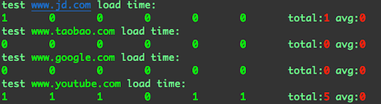
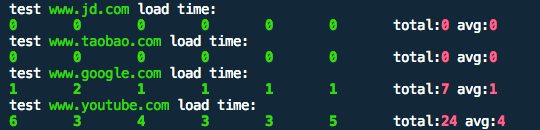

# test-web-load-time
Simple web load testing script using curl command.


# how to

```bash
bash test-web-load-time.sh
```

# output
if your network speed is fast, the load time will be 0 or 1.

test on Google Cloud Platform:



test on my PC:



## note
curl won't "wait" to interpret your Javascript because curl does not understand JavaScript; JavaScript is always done on the client side, and usually browsers that have JavaScript engines/know how to run JavaScript.